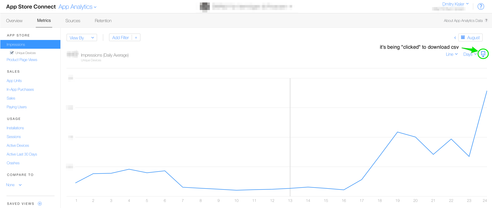

# Itunes Analytics App Data Fetched

Python data fetcher from https://analytics.itunes.apple.com

## Preamble

Despite of anouncement of a new Apple Analytics API at WWDC 2018 in June'18 (see the <a href='https://developer.apple.com/videos/play/wwdc2018/303/' target='_blank'>video</a>), it's not yet available even in the end of August'18. Hence inspired by the node.js' module <a href='https://github.com/JanHalozan/iTunesConnectAnalytics' target='_blank'>itunesconnectanalytics</a>, for my current task, I decided to make a python module to fetch the data from Itunes Analytics App. 

## Logic

The module is made to download csv data files for a given *time* and *metric*. It's based on **selenium** library and uses <a href='http://chromedriver.chromium.org/getting-started' target='_blank'>Chrome WebDriver<a> to emulate real user interacting with the Itunes Analytics App by launching a headless chrome browser (you can easility specify another browser in case it's required).  

Steps:
1. Login to https://appstoreconnect.apple.com using your credentials from **credentials.json**

**credentials.json** structure:
```json
{"user":"YOUR_USER@icloud.com", "pass":"YOUR_ITUNES_PASS"}
```

2. Access https://analytics.itunes.apple.com with specified metric and time frame

List of metrics:

```json
{"impressions": "impressionsTotalUnique", 
 "views": "pageViewUnique", 
 "downloads": "units", 
 "installs": "installs", 
 "sessions": "sessions", 
 "ad": "activeDevices", 
 "crash": "crashes", 
 "purchases": "iap", 
 "bookings": "sales", 
 "pu": "payingUsers"}
```

3. Download the csv data file from the page on step 2 by emulating a click on the "download" icon



#### Example 

As an example, let's fetch **daily installs** during July'18 for the application with the itunes ID *APPID*

Load required modules
```python
import json
import os
from itunes_app_analytics import (Params, 
                                  Login, 
                                  DataFetcher,
                                  browser)
```

Read the appstoreconnect.apple.com (itunes) credentials
```python
PATH = os.path.dirname(__file__)
credentials = json.load(open(os.path.join(PATH, 'credentials.json')))
```

Specify the metrics, time frame and the output folder
```python
# list of metrics
param = Params()
# input parameters
metric = 'downloads'
tframe = 'month'
tview = 'day'
date = '201807'

# output dir
dir_out = '/tmp'
```

Login into https://appstoreconnect.apple.com
```python
_ = Login(credentials['user'], credentials['pass'])
```

Launch a data fetcher "instance" and set the output folder
```python
fetcher = DataFetcher
# set the output folder
fetcher.output_dir(download_dir = dir_out)
```
Download the data and close the browser
```python
downloader = fetcher.download
downloader(APPID, param.measure[metric], param.interval[tframe], param.zoom[tview], date)
browser.close()
```

Done! We've just authomated data extraction from Itunes Analytics.

## Requirements

- Chrome 62+
- Chrome WebDriver (it's provided with the module in the folder **browser**)
- python3.6 (it'll most likely work on 2.7, but it wasn't tested)

Modules (use requiremenets.txt):
- json
- selenium
- time